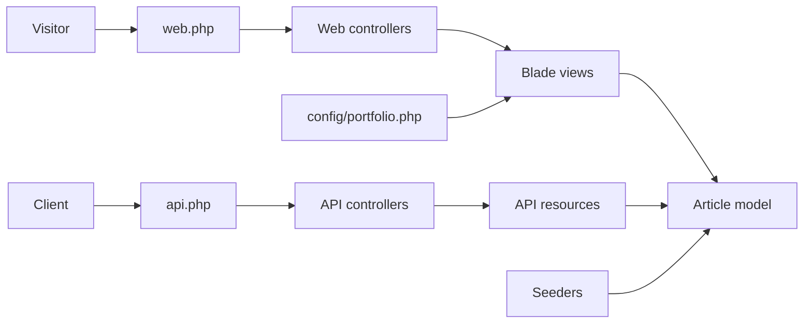

# Design — Personal Blog MVP

## Overview
The MVP keeps the current Laravel application and adds a public blog/portfolio surface for a senior backend engineer. Article content is stored in the database, the owner profile and social links stay config-driven, and the public site is rendered with Blade plus a small asset pipeline that follows the Nothing.tech design rules from `BUILD_PROMPT.md`.

## Architecture
Public requests split into two paths:

- **Web path**: `routes/web.php` → web controllers → Blade layouts/components → article queries + profile config.
- **API path**: `routes/api.php` → API controllers → resources/collections → JSON responses.

Content is seed-driven for MVP. A single `Article` model powers both the public website and the JSON API. Styling lives in `resources/css` and `resources/js`, compiled through Vite, with semantic HTML and restrained motion applied at the Blade layer.

## Components and interfaces
- **`config/portfolio.php`** — owner name, title, tagline, bio, contact links, and featured stats for the homepage.
- **`App\Models\Article`** — Eloquent model with `published()` and `latestPublished()` scopes; the shared source of truth for article data.
- **`database/migrations/*create_articles_table.php`** — schema for title, slug, excerpt, body, `is_published`, and `published_at`.
- **`database/factories/ArticleFactory.php`** — generates realistic demo articles for tests and seeders.
- **`database/seeders/ArticleSeeder.php`** and `DatabaseSeeder` — publish sample profile/article content.
- **`App\Http\Controllers\Web\HomeController`** — renders the landing page.
- **`App\Http\Controllers\Web\ArticleController`** — renders index and show pages.
- **`App\Http\Controllers\Api\ArticleController`** — returns paginated collection and single-article JSON.
- **`App\Http\Resources\ArticleResource`** / `ArticleCollection` — normalize API payloads and keep private fields out.
- **Blade views/components** — `resources/views/layouts`, `pages`, and shared components for hero, section headers, cards, and footer.
- **`resources/css/app.css` + `resources/js/app.js`** — Nothing.tech tokens, layout rules, scroll-reveal hooks, and reduced-motion behavior.

## Data models
### `articles`
- `id`
- `title`
- `slug` (unique)
- `excerpt`
- `body`
- `is_published` (boolean)
- `published_at` (nullable timestamp)
- `created_at` / `updated_at`

### `portfolio` content
Profile content is config-backed rather than persisted for the MVP. That keeps the owner bio and links simple while the article catalog is stored in the database.

### Query rules
- Home page shows the latest published articles.
- Article index shows published articles newest first.
- API list endpoints paginate.
- Article detail lookups resolve by slug.

## Error handling
- Missing article slugs return a 404 response on the website and API.
- Empty article collections render a friendly empty state instead of breaking the page.
- API resources only expose article fields needed by the public site; private/internal fields never leave the controller boundary.
- The current repository has a broken legacy `/api/users` path because `App\Http\Controllers\Api\UserController` is missing; implementation must repair or retire that baseline path before full-suite verification can pass.

## Verification strategy
- **Req 1**: feature test for homepage status 200, owner intro copy, and visible latest-article preview.
- **Req 2**: feature tests for article index, article detail, and missing-article 404s.
- **Req 3**: feature tests for API pagination, JSON shape, auth-free access, and single-article 404s.
- **Req 4**: feature tests for semantic landmarks/focus hooks plus reduced-motion hooks; manual browser review for visual Nothing.tech fidelity.
- **Req 5**: seeder-focused tests for sample profile/article content and private-field omission.
- **Spec-level verification**: `php artisan test`.

## Risks and open questions
- Whether article bodies should stay plain text/HTML-safe text or switch to Markdown later.
- Whether profile content should remain config-backed after MVP or move into the database.
- The repo currently fails its legacy user API tests because the controller file is missing; the blog implementation must not leave that regression unresolved.
- The Nothing.tech rules are intentionally strict; small visual deviations may be acceptable only if they preserve the minimal monochrome intent.
