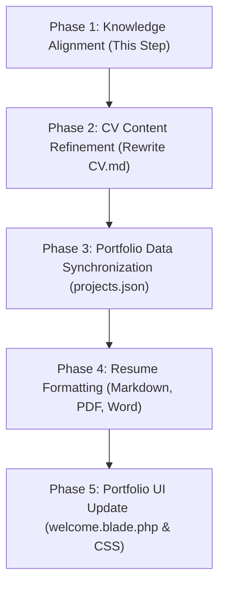

# Career Analysis & Portfolio Strategy
**Target Profile:** Senior Backend & Systems Engineer / Distributed Systems Architect
**Author:** Antigravity AI
**Date:** June 16, 2026

---

## 1. Executive Career Profile Evaluation

An analysis of your professional history reveals a rapid, high-ownership progression from a feature developer to a sole system owner and systems-level engineer. You have a dual-engine career profile: **Enterprise Backend Systems Ownership** + **Open-Source Developer Experience (DX) Tooling**.

```
                         CAREER ACCELERATION TIMELINE
 
 Giraffe Code           Sectors                Rowaad                 Afaqy (Senior)
 (Feb 2021)             (Jul 2021)             (Feb 2022)             (May 2024 - Present)
 ┌──────────────────────┼──────────────────────┼──────────────────────┐
 │ Collab/API           │ Database Design      │ Sole Engineer        │ Kafka Integration
 │ E-commerce apps      │ EdTech Platforms     │ HMVC & MongoDB       │ WASL Compliance
 │ Git & QA foundations │ Third-party APIs     │ Queues & Horizon     │ Sole Backend Owner
 └──────────────────────┴──────────────────────┴──────────────────────┘
 ── Open Source & DX Acceleration ────────────────────────────────────────────────────────►
  (Authoring CLI tools in Go/Python, building security sandboxes, package architecture)
```

### Unique Value Proposition (UVP)
*   **Production Event-Driven Systems:** Real-world execution of Apache Kafka consumers for near-real-time synchronization and domain boundary alignment, going beyond simple database CRUD.
*   **High-Ownership Execution:** Proven capability to serve as the **Sole Engineer** for multiple production platforms (marketplace, e-commerce, booking) and the **Sole Backend Owner** on fleet management platforms in large teams.
*   **Multi-Language Systems Engineering:** A polyglot engineering approach. You write core services in PHP/Laravel but build developer tools and secure utilities in Go and Python, demonstrating deep system-level mechanics (in-memory cryptography, process sandboxing, CLI design).
*   **Architectural Pragmatism:** Deep discipline in testing (Pest/PHPUnit), documentation (OpenAPI), and modularity (HMVC, Repository, Action patterns).

---

## 2. Technology & Skill Matrix

Below is the mapping of your current capabilities against the expected skills for a **high-end Senior Backend/Architect** role.

```mermaid
radar
    title "Skill Matrix — Senior Backend & Systems Engineer"
    "Languages (PHP/Go/Python)": 9
    "Distributed Systems (Kafka/CDC)": 8
    "Database Architecture (MySQL/Mongo)": 8
    "DevOps & Containers (Docker/Podman)": 8
    "Testing & Quality (Pest/Pint/Ruff)": 9
    "DX & CLI Tooling": 9
    "System Design & Patterns (CQRS/HMVC)": 8
    "Security & Cryptography": 7
```

### Core Domain Skills Breakdown

| Category | High-End Skills (Required) | Your Current Coverage | Strategic Action / Placement |
| :--- | :--- | :--- | :--- |
| **Languages** | Polyglot adaptability, strict typing, memory safety. | **Expert**: PHP (5+ years, Expert), OOP.<br>**Advanced**: Python, Go. | Emphasize Go/Python for tooling and systems, and PHP for business domain logic. |
| **Architecture** | Distributed systems, Event-driven architecture (EDA), Domain-Driven Design (DDD). | **Advanced**: Modular design, REST APIs, Kafka, CQRS, Event Sourcing (Verbos). | Transition language from "created APIs" to "architected distributed domain sync with event-streaming." |
| **Databases** | Relational scaling, indexing, replica lag, caching, CDC. | **Advanced**: MySQL indexing, MongoDB, Redis. | Highlight **Debezium/CDC (Change Data Capture)** prototypes and Horizon queue management. |
| **DevOps & Containers**| Infrastructure as Code, container orchestration, Linux server administration. | **Advanced**: Docker, Docker Compose, Podman, Nginx, Linux management. | Show optimization of multi-container setups (Alpine-based, reverse proxying, volume strategies). |
| **Testing & DX** | Unit/Feature testing, CI/CD gates, static analysis, linting. | **Expert**: Pest, PHPUnit, Mockery, Ruff, mypy, strict typing, bandit scanning. | Frame testing as a **reliability guarantee** rather than just a task (e.g., "deterministic test harnesses"). |
| **Security** | Secret management, sandboxing, permission-based access. | **Advanced**: Age encryption, `ZeroBuffer` in-memory zeroing, plugin sandboxing. | Highlight security practices in open-source CLI tools to show deep security hygiene. |

---

## 3. High-End Portfolio Strategy

To reflect your career level, the portfolio must **not** look like a junior/mid-level gallery of websites. It must showcase **system architecture, technical depth, and developer-centric tooling**.

### Design System: `nothing-portfolio` (Nothing.tech Visuals)
*   **Stark Aesthetic:** Pure black (`#000000`) and pure white (`#FFFFFF`) with surgical red (`#FF3B30`) accents. Minimalist and premium.
*   **Nostalgic Typography:** Dot-matrix style displays (`Space Mono` / `JetBrains Mono`) paired with geometric body font (`Inter`).
*   **Architectural Transparency:** The UI itself should expose system details—like memory usage, system status, API load times, or commit hashes—to show you are a backend engineer who cares about system internals.

### Portfolio Project Representation
We will categorize your work into two major sections:
1.  **Distributed & Enterprise Platforms:** Fleet management, freelancing marketplace, digital card integrations. Focus on *system throughput, integrations, and concurrency*.
2.  **Open Source & CLI Systems:** `specd`, `revive`, `clipress`, `frontier`. Show that you build products *for developers*.

---

## 4. CV Revision Strategy (The "High-End" Transformation)

We need to rewrite your experiences to highlight **impact, scale, and architecture** rather than just "tasks completed."

### Experience Rewrite Framework (STAR Method)

#### 1. Afaqy (Senior Backend Engineer)
*   *Old:* "Architected Kafka consumers to synchronise account, vehicle, and driver data..."
*   *New (High-End):* **"Architected and deployed high-throughput Apache Kafka consumers to synchronise fleet telemetry and core data in near real-time across 3 decoupled domains, eliminating manual reconciliation processes."**
*   *Old:* "Integrated WASL (Saudi regulatory tracking service)..."
*   *New (High-End):* **"Designed and integrated WASL regulatory compliance system, implementing idempotent request handling and fail-safe retry mechanics to guarantee 100% compliance audits for fleet trips."**

#### 2. Rowaad (Backend Developer — Sole Engineer)
*   *Old:* "Built a full-featured freelancing marketplace from scratch..."
*   *New (High-End):* **"Served as the Sole Engineer architecting and deploying a freelancing marketplace from database schema to Nginx reverse proxy. Built wallet transaction ledgers with NoonPayments integration and custom match-making algorithms using Laravel HMVC."**
*   *Old:* "Implemented Laravel Queues and Horizon..."
*   *New (High-End):* **"Optimized application latency under peak traffic by decoupling third-party payment, shipping (Aramex), and SMS integrations using Redis-backed Laravel Horizon queue management."**

---

## 5. Implementation Roadmap

We will work through this strategy step-by-step:



### Phase 2: CV Content Refinement (Next Action)
We will edit [CV.md](file:///var/www/html/rai/up/laravel-demo/CV.md) to elevate the language, emphasizing **scale, performance metrics, system design decisions, and architectural ownership**.

### Phase 3: Portfolio Data Synchronization
Once the CV content is finalized, we will update the JSON projects data in [projects.json](file:///var/www/html/rai/up/laravel-demo/database/data/projects.json) and [portfolio.php](file:///var/www/html/rai/up/laravel-demo/config/portfolio.php) to use the real projects, replacing the placeholder Nothing OS details.

### Phase 4: Resume Formatting
We will prepare:
1.  **Markdown CV:** Optimized for GitHub and terminal-based rendering.
2.  **PDF CV:** Print-optimized, beautifully styled via HTML-to-PDF or CSS print media queries.
3.  **Word CV:** Structured cleanly for ATS scanner optimization.
